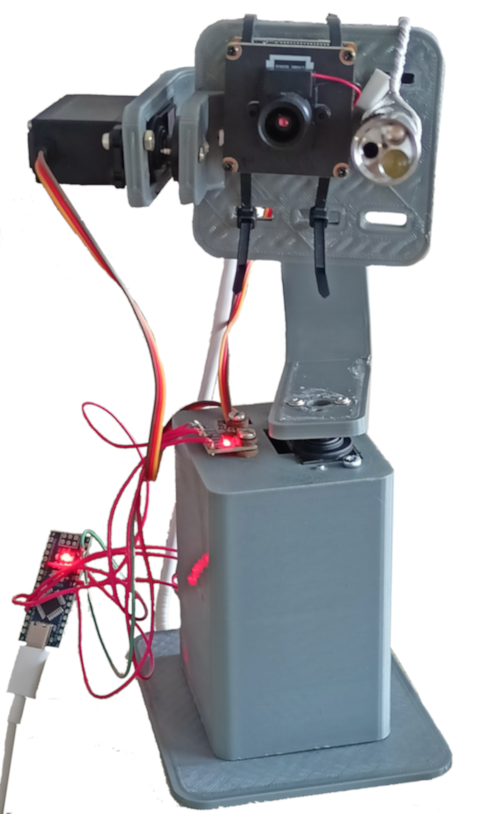

# Embedded-cycled-pointing-method
Репозиторий метода управления системой наведения с функцией стабилизации подвеса (например, антенны) на базе AVR ATmega328p (Arduino Nano). Разработано в 2026 году.

### Компанда проекта:

* Игошин Ярослав Евгеньевич - Разработчик-инженер;
Магистр. Выпускник КНИТУ-КАИ.


* Виноградов Василий Юрьевич - Научный руководитель;
Доктор технических наук, доцент, профессор кафедры КиТПЭС КНИТУ-КАИ.


* Газизов Ильдар Наилевич - Инженер;
Аспирант кафедры КиТПЭС КНИТУ-КАИ

### Клонирование репозитория

```git clone https://gitverse.ru/YaroslavIgoshin/Embedded-cycled-pointing-method.git```

или

```git clone https://github.com/IgoshinYaroslav/Embedded-cycled-pointing-method.git```

### Комплектация:

* Arduino Nano (Отладочная плата)

* MPU-6500

* MG996R 3 шт.

## Структура репозитория
- `Control-method.cpp`: Прошивка метода управления для Arduino IDE.
- `KiCAD-Schematic`: Схема соединений в KiCAD 10.
- `Control_console.bat.txt`: Код исполняемого batch файла командной строки.
- `Main_script.R`: Код исследования в среде разработки RStudio.
- `ReadMe.txt` : Описание к коду исследования
- `View_main.jpg` : Фотография внешнего вида прототипа гиростабилизированной платформы
- `README.md`: Описание

## Фотография прототипа гиростабилизированной платформы:


